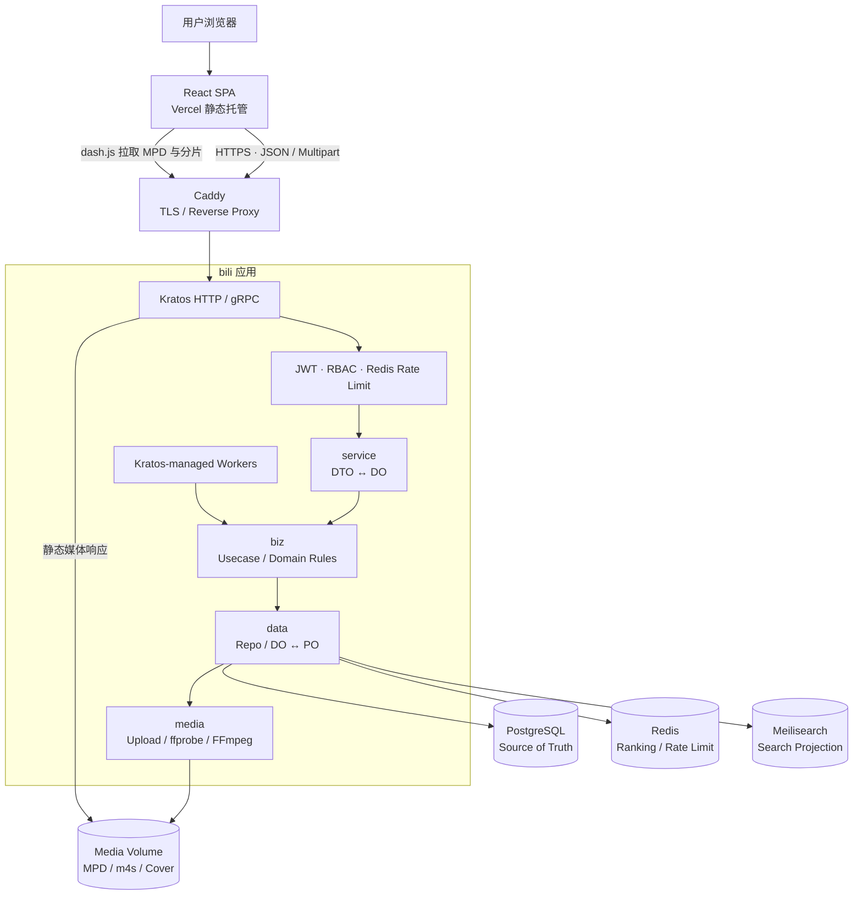
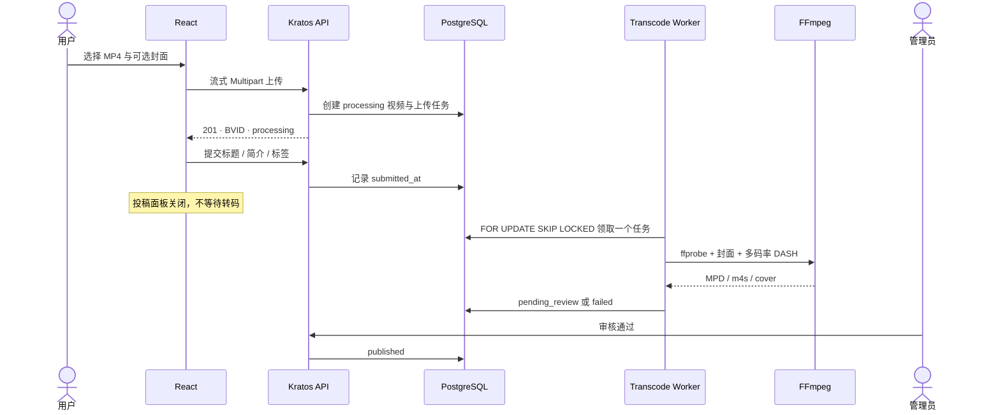
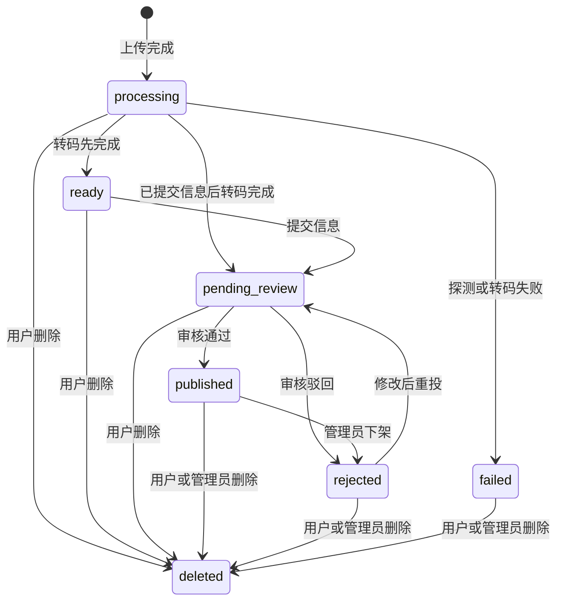
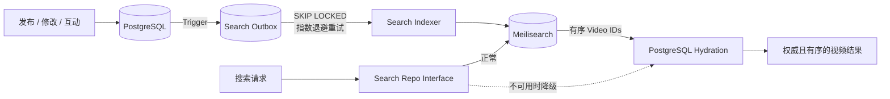
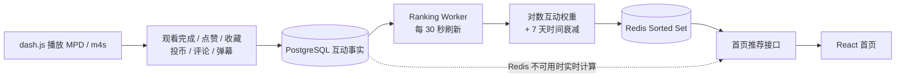

# bilibili-lite

一个围绕视频平台核心链路构建的全栈项目：用户可以注册、投稿、观看和互动；后台以有界任务队列完成多码率转码，由管理员审核发布，并通过独立的搜索索引与 Redis 热榜提供内容发现能力。

[在线体验](https://bilibili-lite.vercel.app/) · [项目仓库](https://github.com/Jingmozhiyu/bilibili-lite)

## 项目能力

- 用户注册、JWT 登录、个人空间与头像管理
- 流式视频上传、用户容量配额、异步 FFmpeg 转码与失败任务回收
- 720p / 1080p / 1440p / 4K 自适应 DASH 播放
- 投稿审核、驳回、重新投稿、下架与媒体清理
- 点赞、投币、收藏、分享、观看历史、评论与弹幕
- Meilisearch 全文搜索、PostgreSQL 降级查询与 Outbox 最终一致性
- Redis 热度衰减排行榜与用户接口限流

## 技术栈

| 模块 | 技术 | 用途 |
| --- | --- | --- |
| Web | React 19、TypeScript、Vite、React Router | 单页应用、用户中心、投稿与审核界面 |
| 播放器 | dash.js、HTML5 Video、`requestAnimationFrame` | 自适应码率播放、快捷键与 60 Hz 弹幕渲染 |
| Backend | Go 1.25、Kratos v3、Protobuf、HTTP/gRPC | API、鉴权、中间件和应用生命周期 |
| Persistence | PostgreSQL 16、GORM、版本化 SQL Migration | 业务事实、事务、审核状态与互动数据 |
| Search | Meilisearch 1.15、Transactional Outbox | 中文全文检索与可重建的搜索投影 |
| Cache | Redis 8、Sorted Set、Lua | 热榜、用户接口限流与原子计数 |
| Media | FFmpeg、ffprobe、MPEG-DASH、H.264/AAC | 探测、封面、多码率转码与分片 |
| Engineering | Wire、Docker Compose、Caddy | 依赖注入、容器编排与 HTTPS 反向代理 |

## 系统全貌



后端遵循 `service → biz → data` 分层：`service` 只负责 DTO 与领域对象转换，`biz` 持有业务规则和仓储接口，`data` 将领域对象映射为持久化模型。媒体处理是独立基础设施，后台任务通过 Kratos Server 生命周期与主服务一起启停。

## 核心链路

### 1. 投稿、转码与审核

上传请求只等待源文件安全落盘和任务入队。前端拿到 BVID 后即可提交标题、简介和标签并离开投稿页，耗时的转码继续在后台执行。





转码队列以数据库行为任务，使用行锁与 `SKIP LOCKED` 安全领取；并发数可配置，默认只运行一个 FFmpeg 任务，避免低配主机被 CPU 密集任务拖垮。中断任务会释放或回收 claim，孤立的临时上传由清理 Worker 定期删除。

### 2. 搜索索引与数据一致性

PostgreSQL 始终保存权威数据，Meilisearch 只保存可丢弃、可重建的搜索投影。业务事务修改视频后，数据库触发器写入 Outbox；独立 Worker 异步更新索引并对失败任务指数退避重试。



这样既不会让发布事务依赖搜索服务，也不会把过期的索引文档直接返回给用户。Meilisearch 启动失败或运行时不可用时，搜索自动回退到 PostgreSQL。

### 3. 热榜推荐与播放互动



热度分数综合播放、点赞、收藏、弹幕、评论和投币，并叠加指数时间衰减。Redis 只负责读取加速；排行榜丢失时可从 PostgreSQL 重建，推荐接口也会自动降级计算。

## 关键设计

| 设计 | 解决的问题 |
| --- | --- |
| PostgreSQL 是唯一事实源 | Redis 和 Meilisearch 故障或清空后仍可恢复 |
| 有界异步转码队列 | 投稿页不等待 FFmpeg，同时限制 CPU 与内存压力 |
| Transactional Outbox | 数据库写入不与外部搜索调用组成脆弱的“双写” |
| 搜索结果二次回表 | 索引只负责召回和排序，最终可见性仍由数据库决定 |
| Redis 排行榜可降级 | 缓存不可用不会阻断首页，数据也不依赖缓存持久化 |
| Desired-state 互动接口 | 重复点赞、收藏请求保持幂等，避免计数漂移 |
| 生命周期托管 Worker | 转码、索引、热榜和清理任务与 Kratos 应用统一启停 |

## 目录结构

```text
api/                 Protobuf API contract 与生成代码
cmd/bilibili-lite/   程序入口和 Wire 装配
configs/             非敏感运行配置
internal/server/     HTTP/gRPC Server 与路由注册
internal/service/    DTO ↔ DO 的传输适配层
internal/biz/        领域对象、用例与 Repo 接口
internal/data/       PostgreSQL/Redis/Meilisearch 实现
internal/media/      上传、ffprobe、FFmpeg 与 DASH 文件
internal/worker/     转码、Outbox、热榜与清理 Worker
internal/middleware/ JWT、RBAC 与 Redis 限流
web/                 React 前端
```

## 运行约束

- 仅接受包含音视频轨的 MP4；旋转信息校正后的画面高度不足 720p 时不转码。
- 输出不放大原视频，只生成源分辨率能够覆盖的 720p / 1080p / 1440p / 4K 档位。
- 单文件默认上限 2 GiB，普通用户总配额 10 GiB，管理员不受配额限制。
- DASH 媒体当前保存在宿主机持久化目录；若要多节点扩展，应替换为共享对象存储。
- Meilisearch 和 Redis 都是可降级依赖；PostgreSQL 与媒体目录是需要备份的核心状态。

## 本地开发

后端及依赖：

```bash
cp .env.example .env
mkdir -p data/media
docker compose --env-file .env up -d --build
```

前端：

```bash
cd web
npm install
npm run dev
```

常用检查：

```bash
go test ./...
cd web && npm run lint && npm run build
```

需要修改 Protobuf、配置结构或 Wire 依赖图时，分别运行 `make api`、`make config` 或 `make all`。真实环境变量保存在被 Git 忽略的 `.env`，仓库只提交 `.env.example`。
